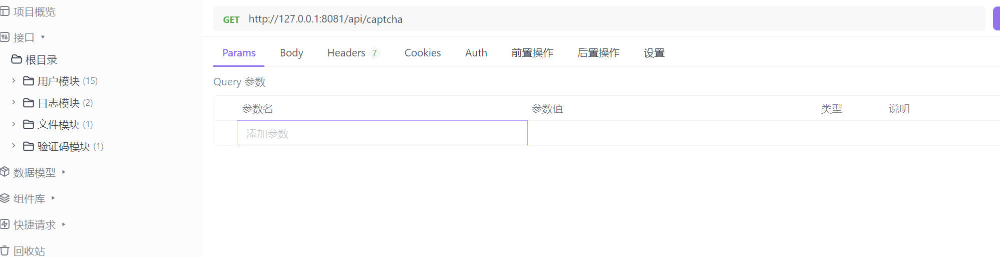

# SpringBoot 项目脚手架

> 作者：[木子Teng](https://github.com/CodeTeng)
> 
> [知识库](https://www.yuque.com/dashboard/books)

基于 JDK17 SpringBoot2.7.18 的项目脚手架，整合了常用框架和主流业务的示例代码



会持续更新，整合目前常用的技术

## 模板特点

### 主流框架 & 特性

- Spring Boot 2.7.18
- Spring MVC
- MyBatis Plus 数据访问（开启分页 自动填充 逻辑删除）
- Spring AOP 切面编程
- Spring Validation 数据校验 
- Spring Scheduler 定时任务
- Spring 事务注解
- Spring Boot 调试工具和项目处理器

### 数据存储

- MySQL 数据库 + Druid 数据库连接池
- Redis 内存数据库 + Redis 连接池
- MongoDB 文档数据库
- Elasticsearch 搜索引擎
- 腾讯云 COS 对象存储

### 工具类

- Easy Excel 表格处理
- Hutool 工具库
- Apache Commons Lang3 工具类
- Lombok 注解

### 业务特性

- Jwt 用户登录 + ThreadLocal 存储
- 自定义线程池 + 多线程异步处理任务
- 全局请求响应拦截器（ AOP 记录日志）
- 全局异常处理器
- 自定义错误码
- 封装通用响应类
- Swagger + Knife4j 接口文档
- 自定义权限注解 + 全局校验
- 全局跨域处理
- 长整数丢失精度解决
- 多环境配置


## 业务功能

- 用户登录、注册、注销、更新、检索、权限管理、用户数据导出、后台CRUD
- 支持微信开放平台登录
- 支持微信公众号订阅、收发消息、设置菜单
- 支持分业务的文件上传

### 单元测试

- JUnit5 单元测试
- 示例单元测试类

### 架构设计

- 合理分层


## 快速上手

### MySQL 配置

1）修改 `application-dev.yml` 的数据库配置为你自己的：

```yml
spring:
  datasource:
    driver-class-name: com.mysql.cj.jdbc.Driver
    url: jdbc:mysql://127.0.0.1:3306/my_db?useUnicode=true&characterEncoding=UTF-8&allowMultiQueries=true&useSSL=false&serverTimezone=Asia/Shanghai
    username: root
    password: 806823
```

2）执行 `sql/create_table.sql` 中的数据库语句，自动创建库表

3）启动项目，访问 `http://localhost:8081/api/doc.html` 即可打开接口文档，不需要写前端就能在线调试接口了~

### Redis 配置

修改 `application-dev.yml` 的 Redis 配置为你自己的：

```yml
spring:
  redis:
    database: 0
    host: localhost
    port: 6379
    timeout: 5000
    password: 
```

### Mongo DB 配置

修改 `application-dev.yml` 的 Redis 配置为你自己的：

```yml
spring:
  data:
    mongodb:
      host: 192.168.150.101 # 主机地址
      username: root # 用户名
      password: root123 # 密码 没有则不写
      database: articledb # 数据库
      authentication-database: admin # 配置了密码的话需要配置去认证的库 (账号密码存放在哪个库里)
      port: 27017 # 端口
      option:
        max-connection-idle-time: 1500
        max-connection-per-host: 200
        max-wait-time: 60000
        max-connection-life-time: 0
        connect-timeout: 10000
        socket-timeout: 60000
```

移除 `MainApplication` 类开头 `@SpringBootApplication` 注解内的 exclude 参数：

```java
@SpringBootApplication(exclude = {MongoAutoConfiguration.class, MongoDataAutoConfiguration.class})
```

### Elasticsearch 搜索引擎

修改 `application-dev.yml` 的 Elasticsearch 配置为你自己的：

```yml
spring:
  elasticsearch:
    uris: http://localhost:9200
    username: root
    password: 123456
```

### COS 对象存储

修改 `application-dev.yml` 的 Elasticsearch 配置为你自己的：

具体配置看：https://cloud.tencent.com/document/product/436/38484

```yml
cos:
  client:
    accessKey: 
    secretKey: 
    region: 
    bucket: 
```

